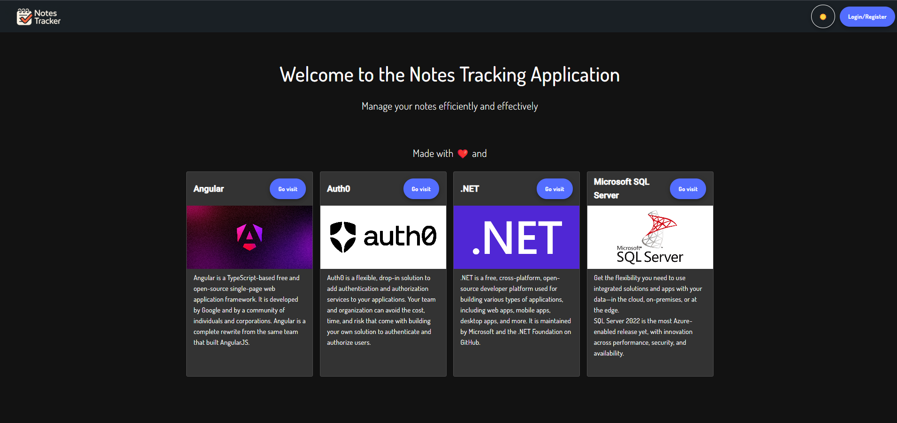
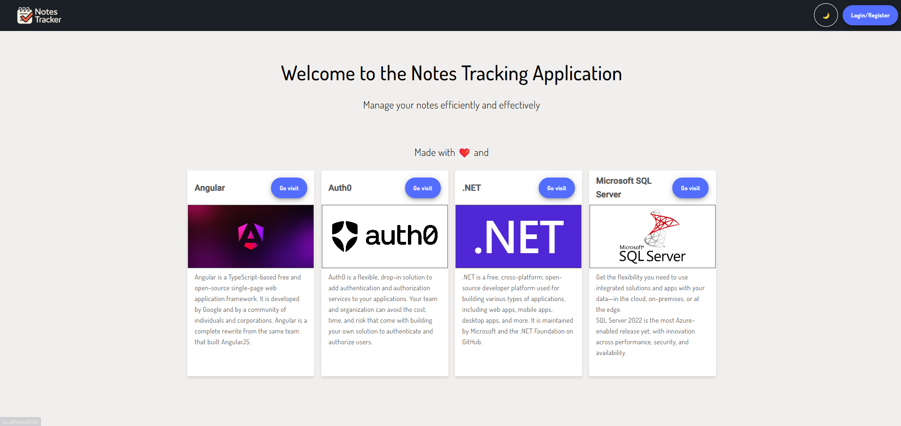
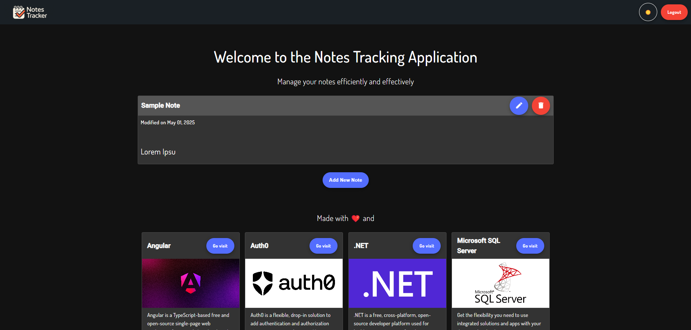
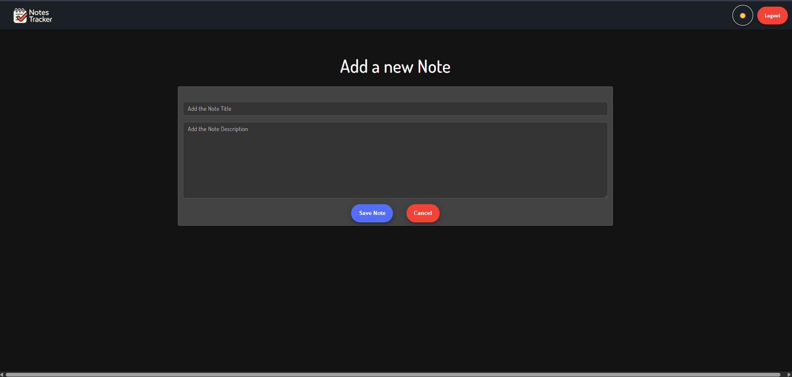
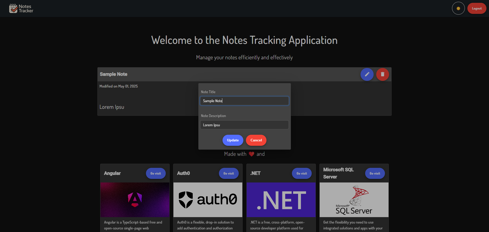

# Introduction

It is a simple ToDo Notes Application that help track your todos and notes. You can add custom notes to this application, edit them and delete simply. It also has user authentication so that notes will not be overlapped for users.

# Design

## App Screens
- Dark Home Screen

- Light Home Screen

- Login/Signup page

- Logged in user home page

- Add Note Page

- Edit Note Popup

## Technologies Used

| Name       | Version |
| ---------- | ------- |
| .NET       | 9       |
| Angular    | 18      |
| SQL Server | 2022    |

## Design Decisions
- The application uses .NET 9 for the backend application. Using .NET is better since it comes out of the box with features like authentication support, custom error handling middlewares and strong framework for database connections and query selections.
- As for the UI, Angular 18 has been used since it is a full-fledged web UI developing framework with full support for Routing, MVC handling, Authentication and Token support along with robust state management.
- The Database used is SQL Server as it is the easiest to use and deploy with complete transparency on the loads and full security on the data. This technology is also compatible with most of the backend frameworks available on the market.
- The main feature is the authentication which is handled by Auth0 framework for user registration and token generation. Each user will be unique with no overlappings and each note will be associated to each user. Auth0 also handles malicious request and social media connections to register.

## Application Workflow
- The user comes to the landing page where user will be asked to login/signup. This feature will be handled via Auth0 authentication.
- Once authorized, the user will be able to create new notes that will be saved to database for the user's mentioned user name.
- Each user will only see their own created note as each note is associated to each user name. Deletion and editing of the notes will also be possible only for the note's authors.
- Notes once created cannot be deleted permanently. They are soft deleted in the database `IsActive=0` and will only be purged yearly by manual intervention.
- TODO: Integrate a stateless function that will sync the user's table from Auth0.

# Getting Started
## Pre-requisites
- .NET SDK (latest)
- Node js and npm
- Angular CLI
- SQL Server Management Studio 18 or latest
- Visual Studio 2022+ IDE
- Visual Studio Code or any text editor of choice

## Installation process
- Install the above mentioned softwares as the first step.
- For the Dotnet backend:
    - Go to the `NotesTracker.API` folder. This will be the api solution root.
    - Open the terminal and run `dotnet build` to install the packages and build the solution.
    - Once the build is successful, run the project by `dotnet run`.
- Once done, for the UI:
    - Go to the `NotesTracker.Web` folder. This will be the web solution root.
    - Open the terminal and perform an `npm install` task to install the node dependencies.
    - Once done, run the script `npm start` or `ng serve`. This will host the application on development server.
- Once the steps are done, visit the website on the localhost uri as mentioned in the terminal for the web root. The application must be up and running!

# Infrastructure
## Build and Deploy
- TODO: The build and deploy steps are a WIP. Will be released once done.

## Branching strategy
- The `main` branch will be containing the stable code that will contain GA release.
- The `dev` branch will be the development branch containing latest nightly build. Might be unstable.

# Contribute
Nothing special. Just clone and code. Do whatever. Use your branches however you want. Add new features which even I don't know about. Use technologies that are latest, old, relic or your own even. 
Go ahead. Just one rule: HAVE FUN.

Happy hacking. Peace out!